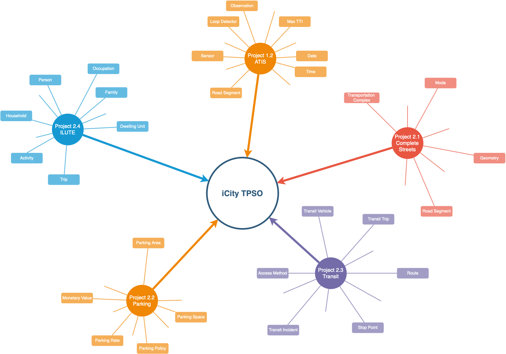
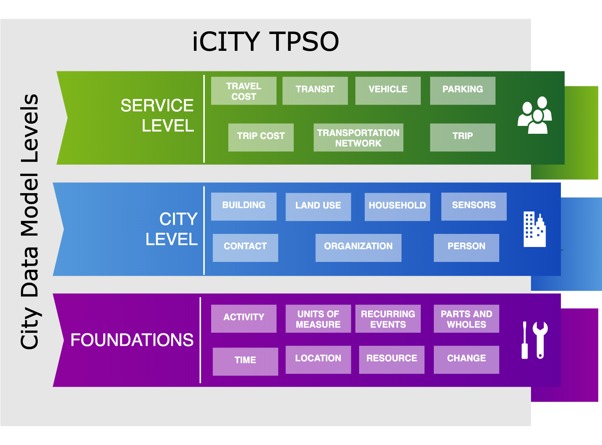

# iCity-ORF Project 1.1: Ontology for Urban Modelling & Design
This repository houses the iCity Transportation Planning Suite of Ontologies (TPSO) developed for the UTTRI [iCity-ORF Project](http://uttri.utoronto.ca/research/projects/icity-urban-informatics-sustainable-metropolitan-growth/). This project is supported by the Ontario Ministry of Research and Innovation through the ORF-RE program.

The ontology has been designed to support the representation and integration of transportation planning data - with a focus on the projects in Theme 2 of iCity-ORF: Urban Mobility & Integrated Urban Systems Design.

The iCity TPSO is comprised of a collection of ontologies, that may be stratefied according to 3 levels: the Foundation, the City Level ontologies, and the Service Level ontologies.

The full report, along with current and past versions of the ontology can be accessed in the [docs folder](./docs/).

The iCity TPSO is serving as initial input to several ISO Standards Projects. Continued development towards this is captured in the ontologies in the [5087 folder](./docs/5087/).

